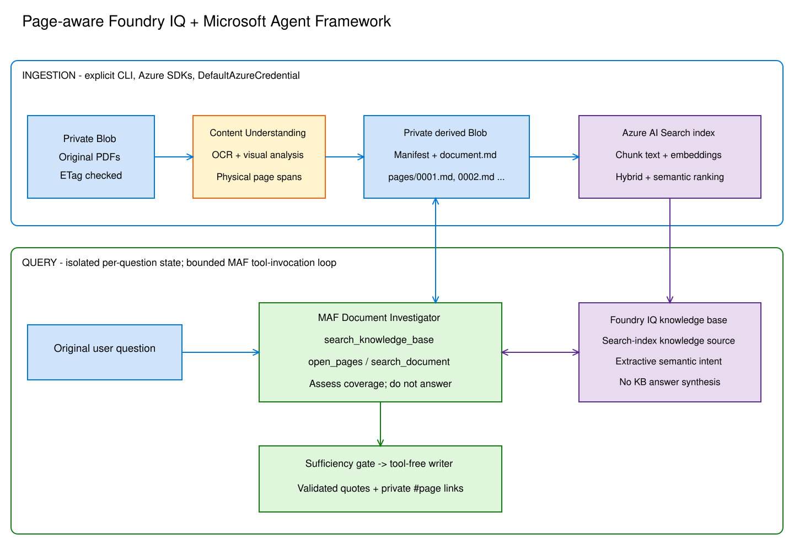

# Hierarchical agentic RAG accelerator

A PDF-first Python accelerator using **Microsoft Agent Framework (MAF)**,
**Foundry IQ / Azure AI Search knowledge bases**, Azure Blob Storage, and Azure
Content Understanding. All Azure clients use `DefaultAzureCredential`.

**Retrieve chunks to find documents. Open the actual referenced pages to gather
evidence. Investigate missing context before allowing answer generation.**

This repository is a local, code-owned agent application, not a deployment of a
Foundry-hosted agent. No Azure resources are created simply by installing or testing it.

## What it does

1. Reads PDFs from a private Blob container.
2. Uses Content Understanding `prebuilt-documentSearch` for PDF OCR/layout plus
   generated figure descriptions and chart/diagram analysis in Markdown.
3. Persists per-page Markdown, the full-document Markdown, and a versioned JSON
   manifest in a separate private Blob container. Page opens download only the
   requested pages; document searches load the full Markdown once per investigation.
4. Embeds each page-bounded chunk and indexes text plus vectors in Azure AI Search,
   preserving the PDF URL, physical page number, source ETag, and extraction revision.
5. Registers that index as an IQ **search-index knowledge source**, then creates an
   IQ **knowledge base** referencing it.
6. Retrieves extractive chunks and source metadata through the knowledge-base API.
7. Runs a MAF agent with `open_pages`, `search_document`, and
   `search_knowledge_base` tools. It opens hit pages, expands adjacent pages,
   locates non-adjacent passages, and searches other documents when needed.
8. Separates the investigator's structured sufficiency assessment from a final,
   tool-free answer writer. Only approved, opened pages reach the writer. Citation
   IDs and exact extracted-Markdown quotes are validated in code. Visual
   interpretations are flagged as potentially generated, not verbatim source facts.

The stable Search API `2026-04-01` supports minimal extractive retrieval, without
knowledge-base LLM query planning or answer synthesis. MAF does the iterative
planning here. Retrieval uses **hybrid keyword + vector search with semantic
ranking**. Chunk embeddings and Search's query vectorizer use the same configured
Azure OpenAI deployment (default `text-embedding-3-large`, 3072 dimensions).
Vectors are excluded from returned evidence and model context. Content
Understanding's model mappings remain separate from Search embeddings.

**Existing installation:** install updated dependencies, configure `HRAG_EMBEDDING_*`,
verify Search's managed-identity access to the embedding resource, run
`hrag provision`, then re-ingest your corpus. Existing chunks do not acquire
vectors automatically. See [hybrid migration](docs/setup.md#hybrid-vector-retrieval-and-migration).

### Why not the automatic Blob knowledge source?

Foundry IQ supports a native Blob knowledge source that creates its own indexer,
skillset, and index. This accelerator deliberately uses the documented
**existing-index knowledge-source** path to own a strict chunk-to-physical-page
contract and full-page extraction cache. Blob remains the original source. We do not
pretend that Text Split "pages" are physical PDF pages, or that every native
ingestion configuration guarantees the metadata this tool needs.

### Retrieval chunking

Chunking is physical-page-bounded and structure-aware, with a maximum of 2,400
characters and up to 200 characters of overlap by default. It prefers CU
paragraph/Markdown heading boundaries and keeps tables, figures and fenced blocks
together when they fit. Oversized structures are split with a warning.

Page-number/page-break metadata is excluded from indexed text and embeddings.
CU-labelled running headers/footers (or their explicit Markdown metadata) are
deduplicated across pages: **the first occurrence stays searchable**, while
later identical occurrences are omitted. Unique footer text, footnotes, and
unlabelled repeated body text are retained. Filtering never rewrites stored page
Markdown or joins text across removed regions; every chunk remains an exact
substring of its physical page.

Re-ingest existing PDFs to apply the new filtering and regenerate their vectors.
No additional Search schema change is needed if hybrid retrieval is already
provisioned. `open_pages` and `search_document` still use the full, unchanged
page content, including headers/footers.

### Persisted document cache

Each ingestion writes an immutable extraction revision:

```text
document-pages/
  <document-id>/
    <revision>.json              # metadata, physical-page spans, paths, SHA-256 hashes
    <revision>/
      document.md               # full Content Understanding Markdown
      analysis.json             # raw CU result, figures, geometry and provenance
      figures.json              # graph JSON, image descriptions and physical-page links
      pages/
        0001.md                 # physical PDF page 1
        0002.md                 # physical PDF page 2
```

`open_pages` reads the manifest and only missing page blobs, then caches them.
`search_document` reads the full Markdown if any pages are not yet cached and
uses the manifest's Unicode spans to recover physical pages. Subsequent page
opens reuse that cache. Neither phase downloads or re-extracts the original PDF;
the source ETag is checked when loading its manifest.

Existing inline-page JSON and Document Intelligence Markdown revisions remain
readable. **Re-run ingestion to add Content Understanding visual analysis** after
updating dependencies, CU configuration and the hybrid Search schema.
See [storage and migration](docs/setup.md#markdown-storage-and-migration).

### Visual-rich PDFs

Each new ingestion also publishes `figures.json` in the extraction revision.
Its `figures` array contains each detected figure's ID, kind, physical page,
source PDF page link, CU source geometry, full-Markdown span and description.
Supported graphs have a `chart` object containing CU's original Chart.js JSON
(labels, datasets, axes/options when returned); diagrams can have `mermaid` text.
Other images retain CU's textual description with `chart: null`.
The artifact includes source identity/ETag, analyzer/API version and
`generated: true`. Missing descriptions are explicitly flagged in `warnings`.
CU can also omit a figure's classification: these entries retain `kind: null`,
their description and page provenance, with an explicit warning rather than
failing ingestion or guessing that they are charts. Unclassified structured
content remains available in the raw `analysis.json`.

This exports the existing CU result, without another LLM call, invented data or
image-asset downloads. Page Markdown still carries CU descriptions/chart blocks
into indexing. The manifest records the figures artifact path and SHA-256 hash.
Re-ingest existing PDFs to produce the new artifact; no Search schema change is needed.

Figure descriptions make labels, legends and depicted relationships searchable,
including in scientific cross-sections and maps. This is not guaranteed scientific
chart digitisation: colour-scale values, depth estimates and geological conclusions
need validation against the PDF. The agent reads cached enriched Markdown, not
rendered pixels, and is instructed to report missing/ambiguous visual context.
Raw figure assets are not downloaded; their descriptions/analysis are retained.

## Quick start (PowerShell)

Requires Python 3.11+; the CU migration was locally validated with Python 3.14.

The environment-creation command below is for a **new** virtual environment.
Do not run it over an existing environment with a different Python version:
compiled packages can remain tied to the old interpreter. See
[environment troubleshooting](docs/setup.md#python-environment-troubleshooting).

```powershell
python -m venv .venv
.\.venv\Scripts\Activate.ps1
python -m pip install -e ".[dev]"
Copy-Item .env.example .env
# Fill in endpoints and your model deployment in .env.
az login
hrag provision
hrag ingest --blob "manuals/product.pdf"
hrag ask "What conditions apply to the extended warranty?"
```

Use `hrag ingest` without `--blob` to process all PDFs in the source container;
`--prefix "manuals/"` narrows the scan. Non-PDF blobs are reported and skipped.
Use `--top N` to cap a scan at N PDFs in Blob listing order:

```powershell
hrag ingest --top 20
hrag ingest --prefix "manuals/" --top 20
```

`N` must be positive; omitted means unlimited. Non-PDF blobs do not count.
Fewer matching PDFs is valid; no matches or an ingestion failure still raises an
error. This is not a newest-first selection or a resume cursor: repeated runs
select the first matching PDFs again. `--top` cannot be combined with `--blob`,
which selects one exact PDF.

Put PDFs into the source container with your normal Azure upload tooling first.

Ingestion shows timestamped progress by default: download, Content Understanding
analysis, artifact uploads, chunk indexing, stale-chunk cleanup, and elapsed times.
For individual page-upload details and the CU operation ID:

```powershell
hrag --verbose ingest --blob "manuals/product.pdf"
# Optionally retain progress/error logs (stderr):
hrag ingest --blob "manuals/product.pdf" 2> ingest.log
```

CU analysis can take several minutes; the submission/wait message remains the
last progress message until it completes or fails. Progress logs omit document
content, but include blob names and revision/operation IDs; keep log files private.

`provision` creates/updates the Search index, knowledge source, and knowledge base.
It does **not** provision an Azure subscription, Search service, Storage account,
Foundry project/model, or Content Understanding configuration. It also checks that the
source container exists and creates the derived-page container if absent.
Use dedicated names: `provision` updates objects with those names.

Query output is structured JSON with status, sufficiency rationale/gaps, answer,
citations, retrieved chunks, full opened evidence, document links, and usage counters.
`insufficient_context` and `budget_exhausted` never contain a synthesized answer.
Service, authentication, malformed-reference, and citation-validation errors fail
explicitly with a nonzero exit code.

### Usage and cost reports

Both commands log elapsed time, operation statistics and **provider-reported**
tokens. Ingestion prints a JSON run summary; `ask` includes the same report under
`usage` in its existing result JSON. To save a separate report, including when a
later operation fails:

```powershell
hrag ingest --top 20 --usage-report .\ingest-usage.json
hrag ask "What conditions apply to the warranty?" --usage-report .\ask-usage.json
```

Use a new filename each run; existing report files are never overwritten.
Reports include embedding batches, CU operations, investigator/writer runs,
input/output tokens and available cached/reasoning subsets. Ingest counters cover
documents, bytes, pages, figures, chunks and artifact uploads. Ask counters cover
searches, tools, opened/cached pages, evidence characters and artifact downloads.
Usage logs/reports exclude document text, questions and answers; ingestion event
metadata does include blob names, so keep reports private.

Optional `HRAG_TOKEN_RATES_USD_PER_MILLION` maps deployment names to your input,
output and optional cached-input rates. No prices are hardcoded. The resulting
USD estimate is a **partial token-only subtotal**, not the full Azure bill:
CU's internal LLM tokens and Search's query-vectorizer tokens are not exposed by
these responses, and page/service/storage charges are excluded. Unknown usage or
cost is `null`, never an invented zero. See
[usage and cost configuration](docs/setup.md#usage-and-cost-reporting) for rates,
failure accounting and coverage details.

## Azure prerequisites

See [setup and operations](docs/setup.md) for resources, RBAC, model capabilities,
private links, live verification, costs, and ingestion lifecycle.

## Architecture and behavior

[](docs/architecture.svg)

The image is a static export of [architecture.excalidraw](docs/architecture.excalidraw).
Regenerate the SVG after editing the diagram to keep this preview in sync.

- [Design and limitations](docs/architecture.md)
- [Editable architecture diagram](docs/architecture.excalidraw)
- [Editable investigation-loop diagram](docs/investigation-loop.excalidraw)
- [Verified API references](docs/references.md)

Open the diagrams in <https://aka.ms/excalidraw> using **Open**.

## Validate locally

```powershell
python -m pytest
python -m ruff check .
python -m mypy
python -m build --wheel
```

Tests use in-memory evidence and mocked Azure transport responses. They check
actual SDK serialization and MAF tool invocation, but do not establish that your
Azure region, permissions, model, or documents work end to end. Follow the live
smoke test in the setup guide after configuration.

In VS Code, press **F5** and select **Investigate PDFs (configured Azure)** to
debug a question through the CLI after setup. This is a console debugger
configuration, not an Agent Inspector HTTP endpoint. A hosted-agent wrapper and
deployment can be added separately.

## Scope

This is a single-trust-boundary accelerator, not a multi-tenant service. It does
not implement per-user document ACL trimming, event-driven ingestion, a web UI,
or infrastructure deployment. Do not expose its application-identity credentials
as a public search API without adding authorization to **both** retrieval and
page expansion.
